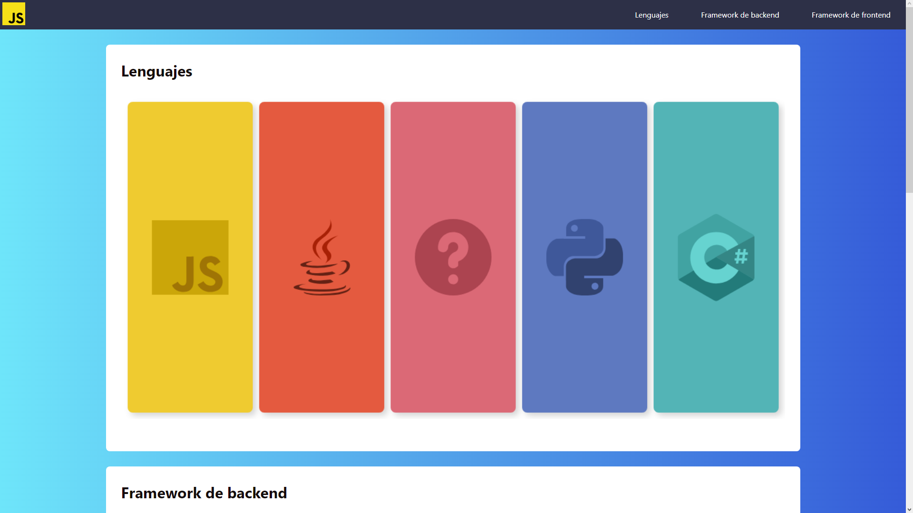

# [Clase modelo JS y jQuery I](https://elliotxleo.github.io/clase-modelo-js-jquery-i) |  |  |   

Diseño de una web básica con efecto de desplazamiento y control del scroll a través de JavaScript y jQuery.

## Instalación
- Ubicarse en la carpeta que contendrá el proyecto
- Abrir terminal de comandos
  - git clone https://github.com/ElliotXLeo/clase-modelo-js-jquery-i
  - cd clase-modelo-js-jquery-i o ir desde el explorador de archivos
  - Abrir el archivo index.html o levantar un servidor con herramientas como Visual Studio Code + Live Server

## Tecnologías usadas
| HTML | CSS | JavaScript | jQuery |
| --- | --- | --- | --- |
|  |  |  |  |

## Redes sociales

- GitHub: https://github.com/ElliotXLeo

- LinkedIn: www.linkedin.com/in/elliotgaramendi

- Facebook: https://web.facebook.com/elliotgaramendi